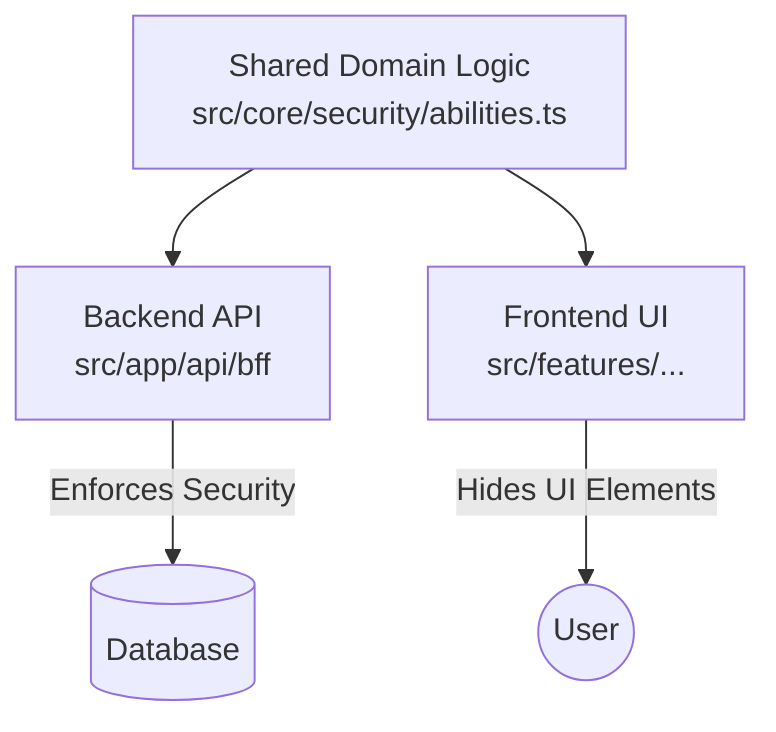

# Enterprise Access Control (CASL Implementation)

This document outlines how to implement our RBAC requirements using [CASL (Common Ability Schema Library)](https://casl.js.org/).

CASL is an isomorphic authorization library that allows us to define permissions in one place and reuse them across the API (Node.js) and UI (React).

## 1. The Strategy

1.  **Define Abilities**: Create a factory function that defines rules based on the user's role.
2.  **Enforce in BFF**: Use the `ForbiddenError` if `ability.can(...)` returns false.
3.  **Use in UI**: Share the same ability definition to conditionally render "Edit" or "Delete" buttons.

---

## 2. Taxonomy (CASL Concepts)

*   **Ability**: The "God Object" that knows everything a user can do.
*   **Subject**: The Entity type (e.g., `'Order'`, `'Product'`) or an actual instance object.
*   **Action**: What you want to do (e.g., `'read'`, `'update'`, `'delete'`, `'manage'`).
*   **Conditions**: The "Fine-Grained" logic (e.g., `{ userId: 123 }`).

---

## 3. Architecture: Shared vs. Frontend vs. Backend

One of the biggest advantages of CASL is that you can reuse the *definition* logic.



### A. Shared Code (`src/core/security/abilities.ts`)
This file contains the **Rules Definition**. It is a pure function that takes a User object and returns an Ability. It has **NO** dependencies on React, Database, or Express.
*   *Responsibility*: "If user is Admin, they can manage all. If Staff, they cannot delete."

### B. Backend Responsibilities (`src/app/api/...`)
The Backend imports the `abilities.ts` file to **Enforce Security**.
*   **Logic**: `if (ability.cannot('read', order)) throw new ForbiddenError()`
*   **Why**: To prevent malicious users from bypassing the UI (e.g., using Postman/CURL).
*   **Field Masking**: The backend MUST physically remove sensitive fields (like `wholesalePrice`) before sending the JSON response.

### C. Frontend Responsibilities (`src/features/...`)
The Frontend imports the `abilities.ts` file to **Improve UX**.
*   **Logic**: `can('update', order) ? <EditButton /> : null`
*   **Why**: To hide buttons the user can't click anyway. It does NOT secure the app (hiding a button is not security), but it makes the UI cleaner.

---

## 4. Implementation Guide

### Step 1: Install Dependencies

```bash
npm install @casl/ability
```

### Step 2: Define Permissions (Shared)

Create `src/core/security/permissions.ts`. This acts as our centralization of rules.

```typescript
import { AbilityBuilder, CreateAbility, createMongoAbility, MongoAbility } from '@casl/ability';

// 1. Define Standard Actions and Subjects
type Actions = 'manage' | 'create' | 'read' | 'update' | 'delete';
type Subjects = 'Order' | 'Product' | 'Review' | 'KPI' | 'Invoice' | 'all';

export type AppAbility = MongoAbility<[Actions, Subjects]>;

interface User {
  id: string;
  role: 'admin' | 'staff' | 'customer';
}

export function defineAbilitiesFor(user: User) {
  const { can, cannot, build } = new AbilityBuilder<AppAbility>(createMongoAbility);

  switch (user.role) {
    case 'admin':
      // ----------------------------------------------------------------
      // ADMIN: Master Access
      // ----------------------------------------------------------------
      can('manage', 'all'); 
      break;

    case 'staff':
      // ----------------------------------------------------------------
      // STAFF: Operational Access
      // ----------------------------------------------------------------
      can('read', 'all');        // Can read most things default
      
      // Explicit Denials (Block sensitive data)
      cannot('read', 'KPI');     // KPI Data is Admin Only
      cannot('delete', 'all');   // Staff cannot delete ANYTHING (Data Integrity)

      // Specific Write Access
      can('create', 'Product');
      can('update', 'Product');
      can('update', 'Order');    // Can change status
      break;

    case 'customer':
      // ----------------------------------------------------------------
      // CUSTOMER: Ownership Access
      // ----------------------------------------------------------------
      // 1. Public Data
      can('read', 'Product');

      // 2. Own Data (Fine-grained conditions)
      // "Can Read Order IF order.userId == user.id"
      can('read', 'Order', { userId: user.id });
      
      // "Can Update User IF user.id == user.id"
      can('update', 'Review', { authorId: user.id });
      can('create', 'Order'); // Creating new order is allowed
      
      // Explicitly block everything else
      cannot('read', 'KPI');
      cannot('manage', 'Invoice');
      break;
  }

  return build();
}
```

### Step 3: Enforce in API (Backend)

In your BFF API routes (`src/app/api/bff/...`), use this helper to protect capabilities.

```typescript
import { defineAbilitiesFor } from '@/core/security/permissions';
import { ForbiddenError } from '@/core/errors'; // Assuming custom error class

export async function GET(req: Request) {
    // 1. Hydrate User (Mock for now, normally from Session)
    const user = { id: 'user_123', role: 'customer' };
    const ability = defineAbilitiesFor(user);

    // 2. Fetch Data (e.g. Order 999)
    const order = await db.order.findUnique({ id: '999' });

    // 3. CHECK PERMISSION
    // "Can the user read THIS specific order object?"
    if (ability.cannot('read', subject('Order', order))) {
        throw new ForbiddenError("You are not allowed to view this order");
    }

    return Response.json(order);
}
```

### Step 4: Use in UI (Frontend)

Use the `<Can>` component or `useAbility` hook to conditionally render UI.

```typescript
// src/features/orders/OrderRow.tsx
import { Can } from '@casl/react';
import { AbilityContext } from '@/core/auth/context';

export const OrderRow = ({ order }) => (
  <tr>
    <td>{order.id}</td>
    <td>
      {/* Only show 'Edit' if user has permission for THIS specific order */}
      <Can I="update" this={subject('Order', order)}>
        <button onClick={handleEdit}>Edit</button>
      </Can>
    </td>
  </tr>
);
```

---

## 5. Why this approach?

1.  **Declarative**: You read the code and know exactly what a `staff` member can do.
2.  **Safe defaults**: "Cannot delete all" for staff is one line.
3.  **Robust**: The `ability.can('read', order)` check automatically verifies `order.userId === user.id` for customers, but ignores it for admins. You don't write `if admin... else if customer...`.
